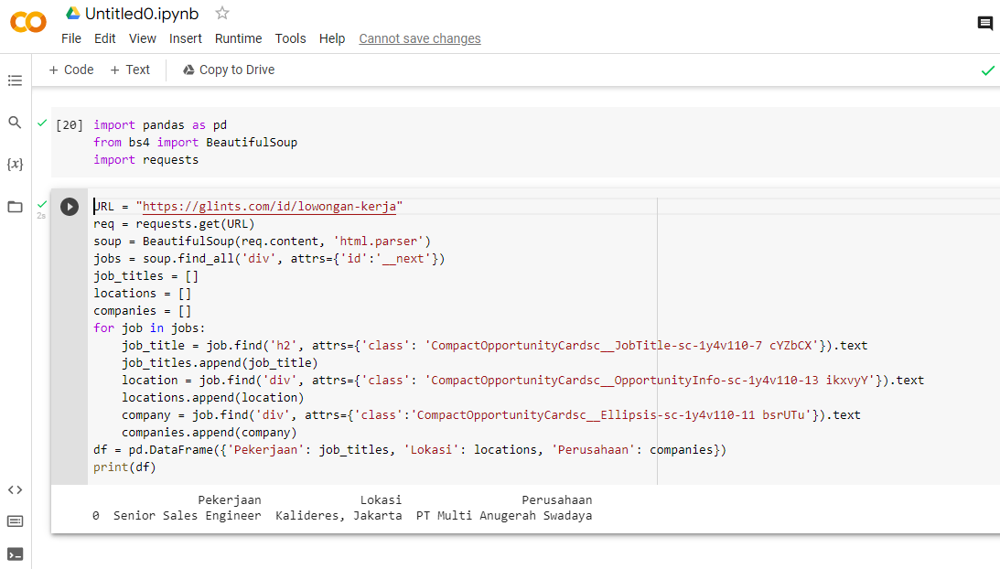

# **Pertemuan 15**
## Persiapan

install library nya yaitu:
* pandas -> untuk manipulasi dan analisis data
* requests -> untuk membuat permintaan HTTP lebih sederhana
* beautifulsoup4 ->  untuk memparsing dokumen HTML, XML dan mengekstrak data dari HTML, yang berguna untuk pengikisan web

## 1. Scraping lowongan kerja

1. Import pandas, beautifulsoup, dan requests
2. Buat beberapa variabel untuk url, list
3. attrs, kamus dengan atribut tag; misalnya`{"class": "nav", "href": "#menuitem"}`
4. Fungsi `find_all` yang dimana untuk mengembalikan semua elemen dari tag yang diberikan. Dan fungsi `find` untuk mengembalikan elemen pertama dari tag yang diberikan.
5. Gunakan loop for
6. Gunakan `append` untuk menambah data
7. Gunakan DataFrame, Data distrukturisasi seperti tabel yang berisi baris dan kolom, sehingga mudah untuk melakukan queri atau mengakses data tersebut

## 2. Scraping Marketplace (Ebay)

langkahnya sama seperti diatas